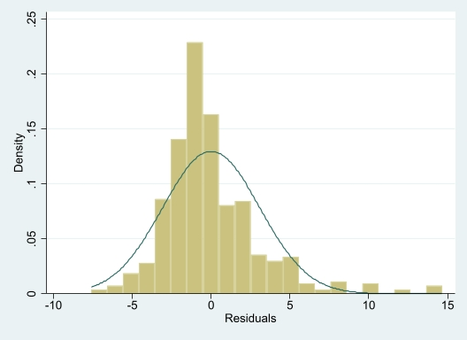
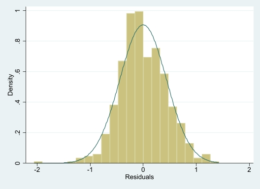

# Assignment - 1: BUAN 6312 Harikrishna Dev HXD220000

## Answers 

1. Use the data in CHARITY [obtained from Franses and Paap (2001)] to answer the following questions:

* What is the average gift in the sample of 4,268 people (in Dutch guilders)? What percentage of people gave no gift?

<p>Average gift is <i>7.4444704</i>.<br>Percentage of people who have no gift is <i>0.60004687</i> (i.e. 60%) </p>


```{STATA}
. use "C:\Users\hxd220000\Desktop\Data Sets- STATA\charity.dta"

. egen gift_mean = mean(gift)

. display gift_mean
7.4444704

. egen count_total = count(respond)

. egen count_gift = count(gift), by (respond)

. display count_gift
2561

. display count_total
4268

. gen count_per = count_gift /count_total

. display count_per
.60004687
```

* What is the average mailings per year? What are the minimum and maximum values?

<p>
Average Mailings per year: 2.049555<br>
Min Mailings per year: 0.25<br>
Max mailings per year: 3.5
</p>

```{STATA}
. summarize mailsyear

    Variable |        Obs        Mean    Std. dev.       Min        Max
-------------+---------------------------------------------------------
   mailsyear |      4,268    2.049555      .66758        .25        3.5
```

* Estimate the model.

$gift =β_0 +  β_1 × mailsyear + u$

 by OLS and report the results in the usual way, including the sample size and R-squared.

$$
gift = 2.01408 + 2.649546 × mailsyear + u
$$

<p>Sample size = 4268 		R-sqr = 0.0138 </p>

```{STATA}
. reg gift mailsyear

      Source |       SS           df       MS      Number of obs   =     4,268
-------------+----------------------------------   F(1, 4266)      =     59.65
       Model |  13349.7251         1  13349.7251   Prob > F        =    0.0000
    Residual |  954750.114     4,266  223.804528   R-squared       =    0.0138
-------------+----------------------------------   Adj R-squared   =    0.0136
       Total |   968099.84     4,267  226.880675   Root MSE        =     14.96

------------------------------------------------------------------------------
        gift | Coefficient  Std. err.      t    P>|t|     [95% conf. interval]
-------------+----------------------------------------------------------------
   mailsyear |   2.649546   .3430598     7.72   0.000     1.976971    3.322122
       _cons |    2.01408   .7394696     2.72   0.006     .5643347    3.463825
------------------------------------------------------------------------------
```

* Interpret the slope coefficient. If each mailing costs one guilder, is the charity expected to make a net gain on each mailing? Does this mean the charity makes a net gain on every mailing? Explain.

<p>
The slope coefficient estimates that one mailing might be resulting in 2.65 additional guilders per year. So, the expected profit per mailing is <i>2.64 - 1 = 1.65 guilders</i>. This value could be lesser or higher based on different scenarios, but the overall average using this model would be the given values. </p>

* What is the smallest predicted charitable contribution in the sample? Using this simple regression analysis, can you ever predict zero for gift?

<p> We know that <i> min(mailsyear) =  0.25 </i>. This makes the smallest predicted contribution <i> gift = 2.01408 + 2.649546 * 0.25 =  2.6764665</i>. As <i> min(gift) = 2.67 </i>, we can't get zero as a predict value.

<div style="page-break-after: always;"></div>

2. The file CEOSAL2 contains data on 177 chief executive officers and can be used to examine the effects of firm performance on CEO salary.

* Estimate a model relating annual salary to firm sales and market value. Make the model of the constant elasticity variety for both independent variables. Report the results in the usual way.

As lsalary, lmktval and lsales are created in the dataset, we are able to generate the lm model.

$$
ln(salary) = 4.620917 + 0.106708 × ln(mktval) + 0.1621283 × ln(sales) + u
$$

```{STATA}
. use "CEOSAL2.dta"

. reg lsalary lsales lmktval

      Source |       SS           df       MS      Number of obs   =       177
-------------+----------------------------------   F(2, 174)       =     37.13
       Model |  19.3365617         2  9.66828083   Prob > F        =    0.0000
    Residual |  45.3096514       174  .260400295   R-squared       =    0.2991
-------------+----------------------------------   Adj R-squared   =    0.2911
       Total |  64.6462131       176  .367308029   Root MSE        =    .51029

------------------------------------------------------------------------------
     lsalary | Coefficient  Std. err.      t    P>|t|     [95% conf. interval]
-------------+----------------------------------------------------------------
      lsales |   .1621283   .0396703     4.09   0.000     .0838315    .2404252
     lmktval |    .106708    .050124     2.13   0.035     .0077787    .2056372
       _cons |   4.620917   .2544083    18.16   0.000     4.118794    5.123041
------------------------------------------------------------------------------
```

* Add profits to the model from part (i), re-estimate the model and report the results in the usual way. Why can this variable not be included in logarithmic form? Would you say that these firm performance variables explain most of the variation in CEO salaries?

<p>As profits can be negative, we cannot use the log function on the profits values.</p>

```{STATA}
. reg lsalary lsales lmktval profits

      Source |       SS           df       MS      Number of obs   =       177
-------------+----------------------------------   F(3, 173)       =     24.64
       Model |  19.3509799         3  6.45032663   Prob > F        =    0.0000
    Residual |  45.2952332       173  .261822157   R-squared       =    0.2993
-------------+----------------------------------   Adj R-squared   =    0.2872
       Total |  64.6462131       176  .367308029   Root MSE        =    .51169

------------------------------------------------------------------------------
     lsalary | Coefficient  Std. err.      t    P>|t|     [95% conf. interval]
-------------+----------------------------------------------------------------
      lsales |   .1613683   .0399101     4.04   0.000     .0825949    .2401416
     lmktval |   .0975286   .0636886     1.53   0.128    -.0281782    .2232354
     profits |   .0000357    .000152     0.23   0.815    -.0002643    .0003356
       _cons |   4.686924   .3797294    12.34   0.000     3.937425    5.436423
------------------------------------------------------------------------------
```

<p>From the regression results, we can that <i>profits</i> has a <i>p value</i> > 0.05. This helps to conclude that the assumption that co-efficient of <i>profits</i> = 0 cannot be rejected

* Add the variable ceoten to the model in part (ii), re-estimate the model and report the results in the usual way. What is the estimated percentage return for another year of CEO tenure, holding other factors fixed?

$$
ln(salary) = 4.620917 + 0.106708 × ln(mktval) + 0.1621283 × ln(sales) + 0.0116847 × ceoten + u
$$

```{STATA}
 reg lsalary lsales lmktval profits ceoten

      Source |       SS           df       MS      Number of obs   =       177
-------------+----------------------------------   F(4, 172)       =     20.08
       Model |  20.5768102         4  5.14420254   Prob > F        =    0.0000
    Residual |  44.0694029       172  .256217459   R-squared       =    0.3183
-------------+----------------------------------   Adj R-squared   =    0.3024
       Total |  64.6462131       176  .367308029   Root MSE        =    .50618

------------------------------------------------------------------------------
     lsalary | Coefficient  Std. err.      t    P>|t|     [95% conf. interval]
-------------+----------------------------------------------------------------
      lsales |   .1622339   .0394826     4.11   0.000     .0843012    .2401667
     lmktval |   .1017598    .063033     1.61   0.108     -.022658    .2261775
     profits |   .0000291   .0001504     0.19   0.847    -.0002677    .0003258
      ceoten |   .0116847    .005342     2.19   0.030     .0011403     .022229
       _cons |    4.55778   .3802548    11.99   0.000     3.807213    5.308347
------------------------------------------------------------------------------
```

<p>From the above regression equation, we can conclude

$\frac{\frac{\Delta salary}{salary}}{\Delta ceoten} = 0.012$

<p>An addition in a year of tenure results in an increase in their salary by 1.2% on an average.</p>

* Find the sample correlation coefficient between the variables log(mktval) and profits. Are these variables highly correlated? What does this say about the OLS estimators? [Hint: You can use the stata command correlate.]

<p>The covariance between <i>ln(mktval)</i> and <i>profits</i> is <b>0.78</b>. The implies there is a highly correlated variables. This doesn't affect the OLS estimators as we assume they are independent variables. Correlation doesn't mean causation.</p>

```{STATA}
. correlate lmktval profits
(obs=177)

             |  lmktval  profits
-------------+------------------
     lmktval |   1.0000
     profits |   0.7769   1.0000
```

<div style="page-break-after: always;"></div>

3. Refer to the example used in Lecture 4 to compare the returns to education at junior colleges and four-year colleges. The model after rearrangement is
   $ log⁡(wage)=β_0+θ_1 jc+β_2 totcoll+β_3 exper+u $,
   where totcoll is total years of college. Use the data set TWOYEAR, which comes from Kane and Rouse (1995).

* Run the regression above and report the OLS estimates in the usual form, including the standard errors, sample size and R-squared. How do you interpret θ_1? Is it statistically significant?

$$
ln(wage) = 1.472326 - 0.0101795 × jc + 0.0768762 × totcoll + 0.0049442 × exper + u
$$

<p><i>θ_1</i> is the percentage increase in wage for unit increase in Junior college credit. As <i>p values > 0.05</i>, we can conclude the parameter <b><i>jc</i> is not significant</b>.</p>

```{STATA}
. use "TWOYEAR.dta"

. reg lwage jc totcoll exper

      Source |       SS           df       MS      Number of obs   =     6,763
-------------+----------------------------------   F(3, 6759)      =    644.53
       Model |  357.752575         3  119.250858   Prob > F        =    0.0000
    Residual |  1250.54352     6,759  .185019014   R-squared       =    0.2224
-------------+----------------------------------   Adj R-squared   =    0.2221
       Total |  1608.29609     6,762  .237843255   Root MSE        =    .43014

------------------------------------------------------------------------------
       lwage | Coefficient  Std. err.      t    P>|t|     [95% conf. interval]
-------------+----------------------------------------------------------------
          jc |  -.0101795   .0069359    -1.47   0.142    -.0237761     .003417
     totcoll |   .0768762   .0023087    33.30   0.000     .0723504    .0814021
       exper |   .0049442   .0001575    31.40   0.000     .0046355    .0052529
       _cons |   1.472326   .0210602    69.91   0.000     1.431041     1.51361
------------------------------------------------------------------------------
```

* The variable phsrank is the person’s high school percentile. (A higher number is better. For example, 90 means you are ranked better than 90 percent of your graduating class.) Find the smallest, largest, and average phsrank in the sample

<p>Parameters of <i>phsrank</i> are as follows:
Minimum: 0
Maximum: 100
Average: 56.15703
</p>

```{STATA}
. summarize phsrank

    Variable |        Obs        Mean    Std. dev.       Min        Max
-------------+---------------------------------------------------------
     phsrank |      6,763    56.15703    24.27296          0         99
```

* Add phsrank to the model and report the OLS estimates in the usual form. Is phsrank statistically significant? How much is 10 percentage points of high school rank worth in terms of wage?

$$
ln(wage) = 1.458747 - 0.0093108 × jc + 0.0754756 × totcoll + 0.0049396 × exper + 0.0003032 × phsrank + u
$$

<p>We can see that <i>phsrank</i> has a <i>p value > 0.05 </i>. Therefore, we can conclude that <i>phsrank</i> is not significant.</p>

<p>From the regression model, we can conclude

$\frac{\frac{\Delta wage}{wage}}{\Delta phsrank} = 0.0003032$

This implies that a 10% increase in phsrank would result in a 0.3% increase in wage.

```{STATA}
 reg lwage jc totcoll exper phsrank

      Source |       SS           df       MS      Number of obs   =     6,763
-------------+----------------------------------   F(4, 6758)      =    483.85
       Model |  358.050568         4  89.5126419   Prob > F        =    0.0000
    Residual |  1250.24552     6,758  .185002297   R-squared       =    0.2226
-------------+----------------------------------   Adj R-squared   =    0.2222
       Total |  1608.29609     6,762  .237843255   Root MSE        =    .43012

------------------------------------------------------------------------------
       lwage | Coefficient  Std. err.      t    P>|t|     [95% conf. interval]
-------------+----------------------------------------------------------------
          jc |  -.0093108   .0069693    -1.34   0.182    -.0229728    .0043512
     totcoll |   .0754756   .0025588    29.50   0.000     .0704595    .0804918
       exper |   .0049396   .0001575    31.36   0.000     .0046308    .0052483
     phsrank |   .0003032   .0002389     1.27   0.204    -.0001651    .0007716
       _cons |   1.458747   .0236211    61.76   0.000     1.412442    1.505052
------------------------------------------------------------------------------
```

* Compare regression results in (i) and (iii), does adding phsrank to the model substantively change the conclusions on the returns to two- and four-year colleges? Explain.

<p>After adding an additional variable <i>phsrank</i>, we see not many changes in terms of magnitude of coefficients of the linear model generated. Therefore, the base point remains unchanged: the return to a junior college is estimated to be somewhat smaller, but the difference is not significant and standard significant levels.</p>

* The data set contains a variable called id. Explain why if you add id to the model you expect it to be statistically insignificant. What is the two-sided p-value?

<p>The variable <i>id</i> is a unique identifier for each employee. It doesn't have any relation with wage. The <i>p value > 0.05</i> which shows that it is not significant. </p>

<p><i> p values (t test on id) = 0.507 </i></p>

```{STATA}
. reg lwage jc totcoll exper phsrank id

      Source |       SS           df       MS      Number of obs   =     6,763
-------------+----------------------------------   F(5, 6757)      =    387.13
       Model |  358.132086         5  71.6264171   Prob > F        =    0.0000
    Residual |  1250.16401     6,757  .185017612   R-squared       =    0.2227
-------------+----------------------------------   Adj R-squared   =    0.2221
       Total |  1608.29609     6,762  .237843255   Root MSE        =    .43014

------------------------------------------------------------------------------
       lwage | Coefficient  Std. err.      t    P>|t|     [95% conf. interval]
-------------+----------------------------------------------------------------
          jc |  -.0093159   .0069696    -1.34   0.181    -.0229784    .0043467
     totcoll |    .075414   .0025606    29.45   0.000     .0703943    .0804336
       exper |    .004941   .0001575    31.37   0.000     .0046322    .0052498
     phsrank |   .0003179     .00024     1.32   0.185    -.0001525    .0007883
          id |   1.40e-07   2.10e-07     0.66   0.507    -2.73e-07    5.52e-07
       _cons |   1.452215   .0255898    56.75   0.000     1.402051    1.502379
------------------------------------------------------------------------------
```

<div style="page-break-after: always;"></div>

4. Use the data set GPA1 to answer this question.

* Run the regression colGPA on PC, hsGPA, and ACT and obtain a 95% confidence interval for βPC. Is the estimated coefficient statistically significant at the 5% level against a two-sided alternative?

<p>The confidence interval of β<sub>PC</sub> is <i>(0.0440271,0.2705913)</i>.</p>

<p>The <i>p value of β<sub>PC</sub> < 0.05</i>, which makes its statistically significant.</p>

```{STATA}
. use "GPA1.dta"

. reg colGPA PC hsGPA ACT

      Source |       SS           df       MS      Number of obs   =       141
-------------+----------------------------------   F(3, 137)       =     12.83
       Model |  4.25741863         3  1.41913954   Prob > F        =    0.0000
    Residual |  15.1486808       137  .110574313   R-squared       =    0.2194
-------------+----------------------------------   Adj R-squared   =    0.2023
       Total |  19.4060994       140  .138614996   Root MSE        =    .33253

------------------------------------------------------------------------------
      colGPA | Coefficient  Std. err.      t    P>|t|     [95% conf. interval]
-------------+----------------------------------------------------------------
          PC |   .1573092   .0572875     2.75   0.007     .0440271    .2705913
       hsGPA |   .4472417   .0936475     4.78   0.000     .2620603     .632423
         ACT |    .008659   .0105342     0.82   0.413    -.0121717    .0294897
       _cons |    1.26352   .3331255     3.79   0.000     .6047871    1.922253
------------------------------------------------------------------------------
```

* Discuss the statistical significance of the estimates $β_hsGPA$ and $β_ACT$ in part (i). Is $hsGPA$ or $ACT$ the more important predictor of colGPA? Explain.

<p>$β_hsGPA$ has a <i>p value < 0.05</i>, which implies that the variable <i>hsGPA</i> is statistically significant.</p>

<p>$β_ACT$ has a <i>p value > 0.05</i>, which implies that the variable <i>hsGPA</i> is not statistically significant.</p>

<p>We can conclude that $hsGPA$ is more important predictor of $colGPA$.</p>

* Add the two indicators fathcoll and mothcoll to the regression in part (i). Is either individually significant? Are they jointly statistically significant at the 5% level?

<p>From the new regression model, we can see that both <i>fathcoll</i> and <i>mothcoll</i> are not statistically significant.

```{STATA}
. reg colGPA PC hsGPA ACT fathcoll mothcoll

      Source |       SS           df       MS      Number of obs   =       141
-------------+----------------------------------   F(5, 135)       =      7.71
       Model |  4.31210399         5  .862420797   Prob > F        =    0.0000
    Residual |  15.0939955       135  .111807374   R-squared       =    0.2222
-------------+----------------------------------   Adj R-squared   =    0.1934
       Total |  19.4060994       140  .138614996   Root MSE        =    .33438

------------------------------------------------------------------------------
      colGPA | Coefficient  Std. err.      t    P>|t|     [95% conf. interval]
-------------+----------------------------------------------------------------
          PC |   .1518539   .0587161     2.59   0.011     .0357316    .2679763
       hsGPA |   .4502203   .0942798     4.78   0.000     .2637639    .6366767
         ACT |   .0077242   .0106776     0.72   0.471    -.0133929    .0288413
    fathcoll |   .0417999   .0612699     0.68   0.496     -.079373    .1629728
    mothcoll |  -.0037579   .0602701    -0.06   0.950    -.1229535    .1154377
       _cons |   1.255554   .3353918     3.74   0.000     .5922526    1.918856
------------------------------------------------------------------------------
```

<div style="page-break-after: always;"></div>

5. Use the data in WAGE1 for this exercise.

* Estimate the equation
  $ wage=β_0+β_1 educ+β_2 exper+β_3 tenure+u $
  and report the OLS estimates in the usual form. Save the residuals and plot a histogram.
  [Hint: 1) You can obtain the residuals of each prediction by using the residuals command and storing these values in a variable named whatever you’d like, e.g., predict resid_wage, residuals. 2) You can use the histogram command to plot a histogram, e.g., histogram resid_wage.]

$$
wage = -2.872735 + 0.5989651 × educ + 0.0223395 × exper + 0.1692687 × tenure + u
$$

```{STATA}
. use "WAGE1.dta"

. reg wage educ exper tenure

      Source |       SS           df       MS      Number of obs   =       526
-------------+----------------------------------   F(3, 522)       =     76.87
       Model |   2194.1116         3  731.370532   Prob > F        =    0.0000
    Residual |  4966.30269       522  9.51398984   R-squared       =    0.3064
-------------+----------------------------------   Adj R-squared   =    0.3024
       Total |  7160.41429       525  13.6388844   Root MSE        =    3.0845

------------------------------------------------------------------------------
        wage | Coefficient  Std. err.      t    P>|t|     [95% conf. interval]
-------------+----------------------------------------------------------------
        educ |   .5989651   .0512835    11.68   0.000     .4982176    .6997126
       exper |   .0223395   .0120568     1.85   0.064    -.0013464    .0460254
      tenure |   .1692687   .0216446     7.82   0.000     .1267474    .2117899
       _cons |  -2.872735   .7289643    -3.94   0.000    -4.304799   -1.440671
------------------------------------------------------------------------------
```

<p> The following code helps us plot a frequency histogram of the residuals</p>

```{STATA}
. predict resid_wage, residuals

. histogram resid_wage, normal
(bin=22, start=-7.6067705, width=1.011835)
```

<p>Histogram plot of the residuals</p>



* Repeat part (i), but with log(wage) as the dependent variable.

<p></p>

```{STATA}
. reg lwage educ exper tenure

      Source |       SS           df       MS      Number of obs   =       526
-------------+----------------------------------   F(3, 522)       =     80.39
       Model |  46.8741776         3  15.6247259   Prob > F        =    0.0000
    Residual |  101.455574       522  .194359337   R-squared       =    0.3160
-------------+----------------------------------   Adj R-squared   =    0.3121
       Total |  148.329751       525   .28253286   Root MSE        =    .44086

------------------------------------------------------------------------------
       lwage | Coefficient  Std. err.      t    P>|t|     [95% conf. interval]
-------------+----------------------------------------------------------------
        educ |    .092029   .0073299    12.56   0.000     .0776292    .1064288
       exper |   .0041211   .0017233     2.39   0.017     .0007357    .0075065
      tenure |   .0220672   .0030936     7.13   0.000     .0159897    .0281448
       _cons |   .2843595   .1041904     2.73   0.007     .0796756    .4890435
------------------------------------------------------------------------------
```

<p> The following code helps us plot a frequency histogram of the residuals</p>

```{STATA}
. predict resid_lwage, residuals

. histogram resid_lwage, normal
(bin=22, start=-2.0580163, width=.15845945)
```

<p>Histogram plot of the residuals</p>



* Would you say that Assumption MLR.6 is closer to being satisfied for the level-level model or the log-level model? Explain.

<p>The log-level model looks to be a normal distributed better than the level-level mode. The level-level model looks to be positively skewed as well. We can also see that sd(residual_wage) is five time the sd(residual_wage). This signifies the homoscedasticity of the log-level model.</p>

```{STATA}
. summarize resid_lwage

    Variable |        Obs        Mean    Std. dev.       Min        Max
-------------+---------------------------------------------------------
 resid_lwage |        526    1.27e-10    .4396006  -2.058016   1.428092

. summarize resid_wage

    Variable |        Obs        Mean    Std. dev.       Min        Max
-------------+---------------------------------------------------------
  resid_wage |        526    1.90e-09     3.07565  -7.606771    14.6536
```

<div style="page-break-after: always;"></div>

6. The model we used in class to explain the standardized outcome on a final exam (stndfnl) in terms of percentage of classes attended, prior college grade point average, and ACT score is
   $ stndfnl=β_0+β_1 × atndrte+β_2 priGPA+β_3 ACT+β_4 priGPA^2+β_5 × ACT^2+β_6 × priGPA × atndrte+u $

* Argue that
  $ \frac{Δstndfnl}{ΔpriGPA}=β_2+2β_4 × priGPA+β_6 × atndrte $

<p> Assuming the regression equation is as follows:</p>

$ stndfnl=β_0+β_1 × atndrte+β_2 priGPA+β_3 ACT+β_4 priGPA^2+β_5 × ACT^2+β_6 × priGPA × atndrte+u $

<p> we partially differentiate wrto <i>priGPA</i> on both sides.</p>

$ \frac{\delta stndfnl}{\delta priGPA} = \frac{\delta (β_0+β_1 × atndrte+β_2 priGPA+β_3 ACT+β_4 priGPA^2+β_5 × ACT^2+β_6 × priGPA × atndrte+u)}{\delta priGPA} $

$ = 0 + 0 + β_2 + 0 + 2 \times β_4 \times priGPA + 0 + β_6 \times priGPA \times 1 $

<p> as </p>

$ \frac{\delta (constant)} {\delta priGPA} = 0 $

<p>and</p>

$ \frac{\delta priGPA^2} {\delta priGPA} = 2 \times priGPA $

$ \therefore \frac{\delta stndfnl}{\delta priGPA} = β_2 + 2 \times β_4 \times priGPA + β_6 \times atndrte $

<p> It can also be written as </p>

$ \frac{\Delta stndfnl}{\Delta priGPA} = β_2 + 2 \times β_4 \times priGPA + β_6 \times atndrte $

* Use the equation above to estimate the partial effect of priGPA on stndfnl when priGPA is at its mean value 2.59, and atndrte is also at it mean value 82. Interpret your estimate. [Hint: The estimated OLS equation can be found in Lecture 5.]

<p>We know that </p>

$\beta _2 = -1.63 , \beta _4 = 0.296 , \beta _6 = 0.0056 $

<p>and</p>

$ \hat {priGPA} = 2.59 , \hat {atndrte} = 82 $

<p>we can compute that</p>

$ \frac{\Delta stndfnl}{\Delta priGPA} = -1.63 + 2 \times 0.296 + 2.59 + 0.0056 \times 82 = 0.36248 $

$ \therefore \frac{\Delta stndfnl}{\Delta priGPA} = 0.36248 $

* Show that the equation can be re-written as
  $ stndfnl=θ_0+β_1 atndrte+θ_2 priGPA+β_3 ACT+β_4 (priGPA-2.59)^2+β_5 ACT^2+β_6 priGPA⋅(atndrte-82)+u, $
  where $ θ_2=β_2+2β_4 (2.59)+β_6 (82) $.
  How do you interpret $θ_2$?

<p>We can solve the equation using the following method:</p>

$ stndfnl=θ_0 + β_1 atndrte + θ_2 \times priGPA + β_3 \times ACT+β_4 \times (priGPA-2.59)^2+β_5 ACT^2+β_6 priGPA⋅(atndrte-82)+u $

$ = θ_0+β_1 \times atndrte + \beta _2 \times priGPA + \beta _3 \times ACT + \beta _3 \times ACT + \beta _4 \times (priGPA -2.59)^2 + \beta _4 \times 2 \times 2.59 \times priGPA - \beta _4 \times (2.59)^2 + \beta _6 \times priGPA \times (atndrte - 82) + \beta _6 \times 82 \times priGPA + u $

$ = [\beta _0 - \beta _4 \times (2.59)^2] + \beta _1 atndrte + [\beta _2 + 2 \times \beta _4 \times 2.59 + \beta _6 \times (0.82)] \times priGPA + \beta _3 \times ACT + \beta _4 \times (priGPA - 2.59)^2 + \beta _5 \times ACT^2 + \beta _6 \times priGPA \times (atndrte - 82) \times (atnfrte - 82) + u $

$ = \theta _0 + \beta _1 atendrte + \theta _2 priGPA + \beta _3 ACT + \beta _4 (priGPA - 2.59)^2 + \beta _5 ACT^2 + \beta _6 priGPA (atndrte -82) + u $

<p>When we run the regression associated with this last model, we obtain <i>θˆ2 ≈ -0.091</i> and <i>se(θˆ2 ) ≈ 0.363</i>. This implies a very small t statistic for θˆ2 .</p>

* Following (iii), suppose that, in place of $ priGPA⋅(atndrte-82)$, you put $(priGPA-2.59)⋅(atndrte-82)$. Now how do you interpret the coefficients on $atndrte$ and $priGPA$?

<p>Using <i>(priGPA - 2.59).(atndrte - 0.82)</i> in place of <i>priGPA.(atndrte - 0.82)</i> gives:</p>

$ stndfnl=β_0+β_1 × atndrte+β_2 priGPA+β_3 ACT+β_4 (priGPA - 2.59)^2+β_5 × ACT^2+β_6 × (priGPA -  2.59) × (atndrte - 82) \times (atndrte - 82) + u $

$ stndfnl=β_0+β_1 × atndrte+β_2 priGPA+β_3 ACT+β_4 (priGPA - 2.59)^2+β_5 × ACT^2+β_6 × (priGPA -  2.59) × (atndrte - 82)^2 + u $

## Code used in STATA

```{STATA}
--------------------------------------------------------------------------------
      name:  HW1
       log:  C:\Users\hxd220000\Desktop\HW1.log
  log type:  text
 opened on:  22 Feb 2023, 17:14:15

. display count_per
.60004687

. egen gift_mean = mean(gift)
variable gift_mean already defined
r(110);

. sysuse auto, clear
(1978 automobile data)

. use "C:\Users\hxd220000\Desktop\Data Sets- STATA\charity.dta"

. egen gift_mean = mean(gift)

. display gift_mean
7.4444704

. egen count_total = count(respond)

. egen count_gift = count(gift), by (respond)

. display count_gift
2561

. display count_total
4268

. gen count_per = count_gift /count_total

. display count_per
.60004687

. save "C:\Users\hxd220000\Desktop\Charity_v2.dta"
file C:\Users\hxd220000\Desktop\Charity_v2.dta saved

. summarize mailsyear

    Variable |        Obs        Mean    Std. dev.       Min        Max
-------------+---------------------------------------------------------
   mailsyear |      4,268    2.049555      .66758        .25        3.5

. reg gift mailsyear

      Source |       SS           df       MS      Number of obs   =     4,268
-------------+----------------------------------   F(1, 4266)      =     59.65
       Model |  13349.7251         1  13349.7251   Prob > F        =    0.0000
    Residual |  954750.114     4,266  223.804528   R-squared       =    0.0138
-------------+----------------------------------   Adj R-squared   =    0.0136
       Total |   968099.84     4,267  226.880675   Root MSE        =     14.96

------------------------------------------------------------------------------
        gift | Coefficient  Std. err.      t    P>|t|     [95% conf. interval]
-------------+----------------------------------------------------------------
   mailsyear |   2.649546   .3430598     7.72   0.000     1.976971    3.322122
       _cons |    2.01408   .7394696     2.72   0.006     .5643347    3.463825
------------------------------------------------------------------------------

. use "CEOSAL2.dta"

. reg lsalary lsales lmktval

      Source |       SS           df       MS      Number of obs   =       177
-------------+----------------------------------   F(2, 174)       =     37.13
       Model |  19.3365617         2  9.66828083   Prob > F        =    0.0000
    Residual |  45.3096514       174  .260400295   R-squared       =    0.2991
-------------+----------------------------------   Adj R-squared   =    0.2911
       Total |  64.6462131       176  .367308029   Root MSE        =    .51029

------------------------------------------------------------------------------
     lsalary | Coefficient  Std. err.      t    P>|t|     [95% conf. interval]
-------------+----------------------------------------------------------------
      lsales |   .1621283   .0396703     4.09   0.000     .0838315    .2404252
     lmktval |    .106708    .050124     2.13   0.035     .0077787    .2056372
       _cons |   4.620917   .2544083    18.16   0.000     4.118794    5.123041
------------------------------------------------------------------------------

. reg lsalary lsales lmktval profits

      Source |       SS           df       MS      Number of obs   =       177
-------------+----------------------------------   F(3, 173)       =     24.64
       Model |  19.3509799         3  6.45032663   Prob > F        =    0.0000
    Residual |  45.2952332       173  .261822157   R-squared       =    0.2993
-------------+----------------------------------   Adj R-squared   =    0.2872
       Total |  64.6462131       176  .367308029   Root MSE        =    .51169

------------------------------------------------------------------------------
     lsalary | Coefficient  Std. err.      t    P>|t|     [95% conf. interval]
-------------+----------------------------------------------------------------
      lsales |   .1613683   .0399101     4.04   0.000     .0825949    .2401416
     lmktval |   .0975286   .0636886     1.53   0.128    -.0281782    .2232354
     profits |   .0000357    .000152     0.23   0.815    -.0002643    .0003356
       _cons |   4.686924   .3797294    12.34   0.000     3.937425    5.436423
------------------------------------------------------------------------------

. reg lsalary lsales lmktval profits ceoten

      Source |       SS           df       MS      Number of obs   =       177
-------------+----------------------------------   F(4, 172)       =     20.08
       Model |  20.5768102         4  5.14420254   Prob > F        =    0.0000
    Residual |  44.0694029       172  .256217459   R-squared       =    0.3183
-------------+----------------------------------   Adj R-squared   =    0.3024
       Total |  64.6462131       176  .367308029   Root MSE        =    .50618

------------------------------------------------------------------------------
     lsalary | Coefficient  Std. err.      t    P>|t|     [95% conf. interval]
-------------+----------------------------------------------------------------
      lsales |   .1622339   .0394826     4.11   0.000     .0843012    .2401667
     lmktval |   .1017598    .063033     1.61   0.108     -.022658    .2261775
     profits |   .0000291   .0001504     0.19   0.847    -.0002677    .0003258
      ceoten |   .0116847    .005342     2.19   0.030     .0011403     .022229
       _cons |    4.55778   .3802548    11.99   0.000     3.807213    5.308347
------------------------------------------------------------------------------

. correlate lmktval profits
(obs=177)

             |  lmktval  profits
-------------+------------------
     lmktval |   1.0000
     profits |   0.7769   1.0000


. use "TWOYEAR.dta"

. reg lwage jc totcoll exper

      Source |       SS           df       MS      Number of obs   =     6,763
-------------+----------------------------------   F(3, 6759)      =    644.53
       Model |  357.752575         3  119.250858   Prob > F        =    0.0000
    Residual |  1250.54352     6,759  .185019014   R-squared       =    0.2224
-------------+----------------------------------   Adj R-squared   =    0.2221
       Total |  1608.29609     6,762  .237843255   Root MSE        =    .43014

------------------------------------------------------------------------------
       lwage | Coefficient  Std. err.      t    P>|t|     [95% conf. interval]
-------------+----------------------------------------------------------------
          jc |  -.0101795   .0069359    -1.47   0.142    -.0237761     .003417
     totcoll |   .0768762   .0023087    33.30   0.000     .0723504    .0814021
       exper |   .0049442   .0001575    31.40   0.000     .0046355    .0052529
       _cons |   1.472326   .0210602    69.91   0.000     1.431041     1.51361
------------------------------------------------------------------------------

. display jc
0

. summarize jc

    Variable |        Obs        Mean    Std. dev.       Min        Max
-------------+---------------------------------------------------------
          jc |      6,763    .3388946    .7721268          0   3.833333

. reg lwage jc totcoll exper phsrank

      Source |       SS           df       MS      Number of obs   =     6,763
-------------+----------------------------------   F(4, 6758)      =    483.85
       Model |  358.050568         4  89.5126419   Prob > F        =    0.0000
    Residual |  1250.24552     6,758  .185002297   R-squared       =    0.2226
-------------+----------------------------------   Adj R-squared   =    0.2222
       Total |  1608.29609     6,762  .237843255   Root MSE        =    .43012

------------------------------------------------------------------------------
       lwage | Coefficient  Std. err.      t    P>|t|     [95% conf. interval]
-------------+----------------------------------------------------------------
          jc |  -.0093108   .0069693    -1.34   0.182    -.0229728    .0043512
     totcoll |   .0754756   .0025588    29.50   0.000     .0704595    .0804918
       exper |   .0049396   .0001575    31.36   0.000     .0046308    .0052483
     phsrank |   .0003032   .0002389     1.27   0.204    -.0001651    .0007716
       _cons |   1.458747   .0236211    61.76   0.000     1.412442    1.505052
------------------------------------------------------------------------------

. summarize phsrank

    Variable |        Obs        Mean    Std. dev.       Min        Max
-------------+---------------------------------------------------------
     phsrank |      6,763    56.15703    24.27296          0         99

. reg lwage jc totcoll exper phsrank id

      Source |       SS           df       MS      Number of obs   =     6,763
-------------+----------------------------------   F(5, 6757)      =    387.13
       Model |  358.132086         5  71.6264171   Prob > F        =    0.0000
    Residual |  1250.16401     6,757  .185017612   R-squared       =    0.2227
-------------+----------------------------------   Adj R-squared   =    0.2221
       Total |  1608.29609     6,762  .237843255   Root MSE        =    .43014

------------------------------------------------------------------------------
       lwage | Coefficient  Std. err.      t    P>|t|     [95% conf. interval]
-------------+----------------------------------------------------------------
          jc |  -.0093159   .0069696    -1.34   0.181    -.0229784    .0043467
     totcoll |    .075414   .0025606    29.45   0.000     .0703943    .0804336
       exper |    .004941   .0001575    31.37   0.000     .0046322    .0052498
     phsrank |   .0003179     .00024     1.32   0.185    -.0001525    .0007883
          id |   1.40e-07   2.10e-07     0.66   0.507    -2.73e-07    5.52e-07
       _cons |   1.452215   .0255898    56.75   0.000     1.402051    1.502379
------------------------------------------------------------------------------

. use "GPA1.dta"

. reg colGPA PC hsGPA ACT

      Source |       SS           df       MS      Number of obs   =       141
-------------+----------------------------------   F(3, 137)       =     12.83
       Model |  4.25741863         3  1.41913954   Prob > F        =    0.0000
    Residual |  15.1486808       137  .110574313   R-squared       =    0.2194
-------------+----------------------------------   Adj R-squared   =    0.2023
       Total |  19.4060994       140  .138614996   Root MSE        =    .33253

------------------------------------------------------------------------------
      colGPA | Coefficient  Std. err.      t    P>|t|     [95% conf. interval]
-------------+----------------------------------------------------------------
          PC |   .1573092   .0572875     2.75   0.007     .0440271    .2705913
       hsGPA |   .4472417   .0936475     4.78   0.000     .2620603     .632423
         ACT |    .008659   .0105342     0.82   0.413    -.0121717    .0294897
       _cons |    1.26352   .3331255     3.79   0.000     .6047871    1.922253
------------------------------------------------------------------------------

. reg colGPA PC hsGPA ACT fathcoll mothcoll

      Source |       SS           df       MS      Number of obs   =       141
-------------+----------------------------------   F(5, 135)       =      7.71
       Model |  4.31210399         5  .862420797   Prob > F        =    0.0000
    Residual |  15.0939955       135  .111807374   R-squared       =    0.2222
-------------+----------------------------------   Adj R-squared   =    0.1934
       Total |  19.4060994       140  .138614996   Root MSE        =    .33438

------------------------------------------------------------------------------
      colGPA | Coefficient  Std. err.      t    P>|t|     [95% conf. interval]
-------------+----------------------------------------------------------------
          PC |   .1518539   .0587161     2.59   0.011     .0357316    .2679763
       hsGPA |   .4502203   .0942798     4.78   0.000     .2637639    .6366767
         ACT |   .0077242   .0106776     0.72   0.471    -.0133929    .0288413
    fathcoll |   .0417999   .0612699     0.68   0.496     -.079373    .1629728
    mothcoll |  -.0037579   .0602701    -0.06   0.950    -.1229535    .1154377
       _cons |   1.255554   .3353918     3.74   0.000     .5922526    1.918856
------------------------------------------------------------------------------

. use "WAGE1.dta"

. reg wage educ exper tenure

      Source |       SS           df       MS      Number of obs   =       526
-------------+----------------------------------   F(3, 522)       =     76.87
       Model |   2194.1116         3  731.370532   Prob > F        =    0.0000
    Residual |  4966.30269       522  9.51398984   R-squared       =    0.3064
-------------+----------------------------------   Adj R-squared   =    0.3024
       Total |  7160.41429       525  13.6388844   Root MSE        =    3.0845

------------------------------------------------------------------------------
        wage | Coefficient  Std. err.      t    P>|t|     [95% conf. interval]
-------------+----------------------------------------------------------------
        educ |   .5989651   .0512835    11.68   0.000     .4982176    .6997126
       exper |   .0223395   .0120568     1.85   0.064    -.0013464    .0460254
      tenure |   .1692687   .0216446     7.82   0.000     .1267474    .2117899
       _cons |  -2.872735   .7289643    -3.94   0.000    -4.304799   -1.440671
------------------------------------------------------------------------------

. predict resid_wage, residuals

. histogram resid_wage
(bin=22, start=-7.6067705, width=1.011835)

. graph save "Graph" "C:\Users\hxd220000\Desktop\Graph.gph"
file C:\Users\hxd220000\Desktop\Graph.gph saved

. graph export "C:\Users\hxd220000\Desktop\Graph.jpg", as(jpg) name("Graph") qua
> lity(90)
file C:\Users\hxd220000\Desktop\Graph.jpg written in JPEG format

. reg lwage educ exper tenure

      Source |       SS           df       MS      Number of obs   =       526
-------------+----------------------------------   F(3, 522)       =     80.39
       Model |  46.8741776         3  15.6247259   Prob > F        =    0.0000
    Residual |  101.455574       522  .194359337   R-squared       =    0.3160
-------------+----------------------------------   Adj R-squared   =    0.3121
       Total |  148.329751       525   .28253286   Root MSE        =    .44086

------------------------------------------------------------------------------
       lwage | Coefficient  Std. err.      t    P>|t|     [95% conf. interval]
-------------+----------------------------------------------------------------
        educ |    .092029   .0073299    12.56   0.000     .0776292    .1064288
       exper |   .0041211   .0017233     2.39   0.017     .0007357    .0075065
      tenure |   .0220672   .0030936     7.13   0.000     .0159897    .0281448
       _cons |   .2843595   .1041904     2.73   0.007     .0796756    .4890435
------------------------------------------------------------------------------

. predict resid_wage, residuals
variable resid_wage already defined
r(110);

. predict resid_lwage, residuals

. histogram resid_lwage
(bin=22, start=-2.0580163, width=.15845945)

. graph export "C:\Users\hxd220000\Desktop\Graph-lwage.jpg", as(jpg) name("Graph
> ") quality(100)
file C:\Users\hxd220000\Desktop\Graph-lwage.jpg written in JPEG format

. graph save "Graph" "C:\Users\hxd220000\Desktop\Graph-lwage.gph"
file C:\Users\hxd220000\Desktop\Graph-lwage.gph saved
histogram resid_wage, normal
(bin=22, start=-7.6067705, width=1.011835)

. graph save "Graph" "C:\Users\hxd220000\Desktop\Graph.gph", replace
file C:\Users\hxd220000\Desktop\Graph.gph saved

. graph export "C:\Users\hxd220000\Desktop\Graph.jpg", as(jpg) name("Graph") qua
> lity(100) replace
file C:\Users\hxd220000\Desktop\Graph.jpg written in JPEG format

. histogram resid_lwage, normal
(bin=22, start=-2.0580163, width=.15845945)

. graph save "Graph" "C:\Users\hxd220000\Desktop\Graph-lwage.gph", replace
file C:\Users\hxd220000\Desktop\Graph-lwage.gph saved

. graph export "C:\Users\hxd220000\Desktop\Graph-lwage.jpg", as(jpg) name("Graph
> ") quality(100) replace
file C:\Users\hxd220000\Desktop\Graph-lwage.jpg written in JPEG format

. summarize resid_lwage

    Variable |        Obs        Mean    Std. dev.       Min        Max
-------------+---------------------------------------------------------
 resid_lwage |        526    1.27e-10    .4396006  -2.058016   1.428092

. summarize resid_wage

    Variable |        Obs        Mean    Std. dev.       Min        Max
-------------+---------------------------------------------------------
  resid_wage |        526    1.90e-09     3.07565  -7.606771    14.6536

--------------------------------------------------------------------------------
```